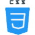

<h2>About</h2>

  Hi, my name is <b>Syed Nouman</b>, a junior developer from Pakistan.  
I am final year student at <a href="http://pucit.edu.pk">PUCIT</a> Lahore. I work on different web projects. You can contact me for queries regarding any project.

---

<h3>Interests</h3>
<ul>
  <li>Web Development</li>
  <li>Android Apps</li>
   <li>Problem Solving</li>
   <li>Designing</li>
  
</ul>

---

  
  

---

<h3>Links</h3>
 

 

---

<h3>Skills</h3>

---

<h3>Hobbies</h3> 
<ul>
  <li>Learning New Skills 🤓</li> 
  <li>Cricket ✨</li>
</ul>

---

<!--
**NoumanShah042/NoumanShah042** is a ✨ _special_ ✨ repository because its `README.md` (this file) appears on your GitHub profile.

Here are some ideas to get you started:

- 🔭 I’m currently working on ...
- 🌱 I’m currently learning ...
- 👯 I’m looking to collaborate on ...
- 🤔 I’m looking for help with ...
- 💬 Ask me about ...
- 📫 How to reach me: ...
- 😄 Pronouns: ...
- ⚡ Fun fact: ...
-->
